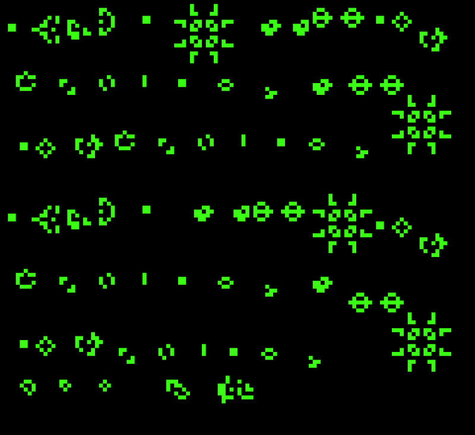

# Conway's Game of Life

Implementación en Rust del Juego de la Vida de Conway, usando [minifb](https://github.com/emoon/rust_minifb) para el manejo de ventana y framebuffer.

## Cómo correrlo

```bash
cd Conways-GoL
cargo run --release
```

Presiona `ESC` para cerrar la ventana.

## Estructura

- `src/framebuffer.rs`: el `Framebuffer`, con `point(x, y, color)` para pintar una celda y `get_color(x, y)` para leerla.
- `src/life.rs`: las reglas de Conway (`step`), con vecindario toroidal (los bordes hacen loop hacia el lado opuesto).
- `src/patterns.rs`: los organismos iniciales (still lifes: block, beehive, loaf, boat, tub; osciladores: blinker, toad, beacon, pulsar, pentadecathlon; naves: glider, LWSS, MWSS, HWSS; más r-pentomino, diehard, acorn y el Gosper Glider Gun).
- `src/main.rs`: crea la ventana (framebuffer de 120x110 escalado x8) y corre el loop de render.

## Patrón inicial

El tablero arranca con dos Gosper Glider Gun disparando gliders sin parar, varias naves espaciales (LWSS, MWSS, HWSS), pulsares, pentadecathlons, y todos los patrones clásicos de la lista (still lifes, osciladores y naves) repartidos en franjas por todo el tablero.

## Demo



Para regenerar el gif (requiere [ffmpeg](https://ffmpeg.org/) instalado y en el PATH):

```powershell
.\record_demo.ps1
```

Esto compila el proyecto, abre la ventana, graba 10 segundos y genera `demo.gif` en la raíz del repo.
